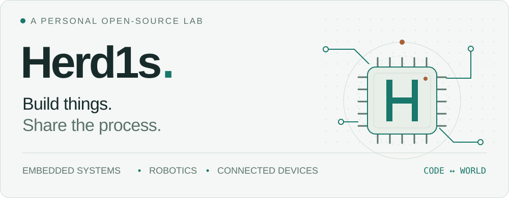
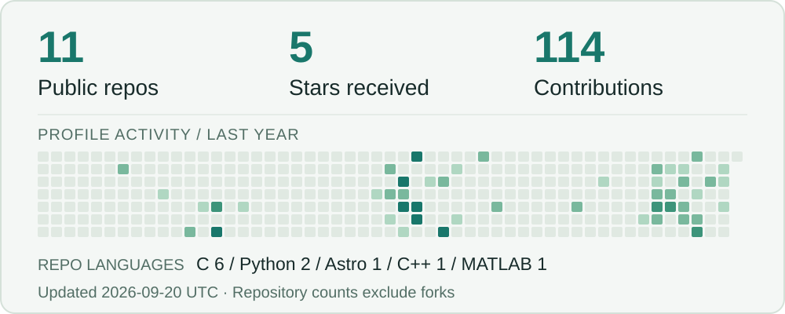

<picture>
  <source media="(prefers-color-scheme: dark)" srcset="assets/hero-dark.svg">
  <source media="(prefers-color-scheme: light)" srcset="assets/hero-light.svg">
  
</picture>

  <a href="https://github.com/Herd1s?tab=repositories"><b>探索我的项目 ↗</b></a>
  &nbsp;&nbsp; / &nbsp;&nbsp;
  <a href="https://github.com/Herd1s/Herd1s.github.io">博客与记录 ↗</a>

### 从一块开发板，到一套完整系统。

你好，我是 **Herd1s**。我在嵌入式、机器人与联网设备之间探索，喜欢让代码走出屏幕，与真实世界发生连接。

从传感器采集、设备通信，到服务端和手机界面，我把想法拆成可以实现的模块，再把它们连接起来。这里记录我的项目、实验，以及让作品逐步成形的过程。

 

## 01 / Selected work

<table>
  <tr>
    <td width="50%" valign="top">
      ROBOTICS · 轮足机器人
      <h3><a href="https://github.com/Herd1s/Wheelbot_RDK">Wheelbot_RDK ↗</a></h3>
      
基于 RDK X5 的轮足机器人项目，探索运动控制、自主巡检与 SLAM 建图。

      
<code>C++</code> <code>ROS 2</code> <code>RDK X5</code>

      
把感知、控制与机器人系统连接起来。

    </td>
    <td width="50%" valign="top">
      CONNECTED DEVICES · 室内安防
      <h3><a href="https://github.com/Herd1s/HomeDevice">HomeDevice ↗</a></h3>
      
串起传感器、Wi-Fi 网关、后端与手机端，实现环境监测、远程控制与告警。

      
<code>STM32</code> <code>ESP32</code> <code>FastAPI</code>

      
从现场采集到手机交互的完整链路。

    </td>
  </tr>
  <tr>
    <td width="50%" valign="top">
      EMBEDDED · 空气监测
      <h3><a href="https://github.com/Herd1s/AirDevice">AirDevice ↗</a></h3>
      
基于 STM32 的多传感器监测项目，结合蓝牙交互、数据滤波与风扇告警联动。

      
<code>C</code> <code>STM32</code> <code>BLE</code>

      
让采集、交互与设备响应协同工作。

    </td>
    <td width="50%" valign="top">
      COMPUTER VISION · 视觉追踪
      <h3><a href="https://github.com/Herd1s/2025-">视觉追踪实验 ↗</a></h3>
      
围绕目标检测与追踪展开实验，结合 Kalman 滤波、串口通信与云台联动。

      
<code>Python</code> <code>OpenCV</code> <code>NumPy</code>

      
把图像中的目标变成设备可用的信号。

    </td>
  </tr>
</table>

 

## 02 / My toolkit

项目里使用的工具，也在实践中持续学习。

| 方向 | 技术与实践 |
| :--- | :--- |
| **嵌入式开发** | C / C++ · STM32 · ESP32 / ESP-IDF · UART · I²C · ADC |
| **机器人与视觉** | ROS 2 · RDK X5 · Python · OpenCV · NumPy |
| **设备与应用** | FastAPI · SQLite · HTTP / WebSocket · uni-app |
| **工程与记录** | Git · CMake · 接口联调 · 项目文档 |

 

## 03 / Open-source activity

<picture>
  <source media="(prefers-color-scheme: dark)" srcset="assets/stats-dark.svg">
  <source media="(prefers-color-scheme: light)" srcset="assets/stats-light.svg">
  
</picture>

贡献数按 GitHub 主页展示口径；仓库与 Star 仅统计非 fork 公开仓库。语言按仓库主语言计数。<a href="assets/stats.json">查看数据快照 ↗</a>

 
 

---

  <b>把想法做出来，也把过程留下来。</b> 
  Build things. Share the process.

  如果你也在做机器人、嵌入式或联网设备，欢迎在相关项目的 Issue 中交流。

